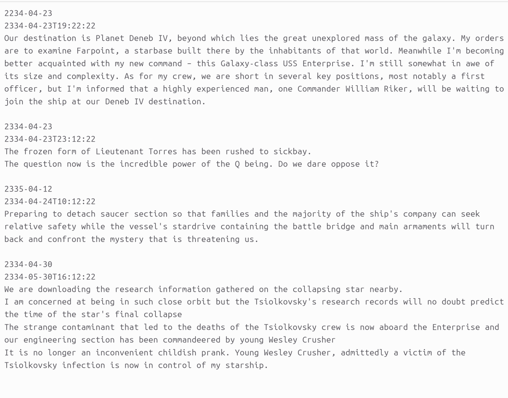

# caplog.txt
A comprehensive guide on the syntax and semantics of the caplog.txt log file format

# Description

Caplog.txt is an open-source, plaintext syntax for formatting and structuring personal log files. It is both machine-readable and human-readable. 
It is future-proof and designed to be interoperable with multiple independent implementations. The plain text syntax is inspired by TODO.txt project. The concept and the name are derived from Star Trek. 


# Terminology

* Log Entry or Entry - The basic unit of information that describes an event. It consists of three parts:
    - DateTime - The time at which the event occurred. 
    - Timestamp - The time at which the log entry was updated. 
    - Message - The actual message of the log entry
* Logbook- A collection of related log entries.  
* To log an entry means to add an entry to the logbook. 


# Syntax

* Log entries are separated from each other by one or more blank lines. 
* The first line of the entry must be 'DateTime'
* The second line of the entry must be 'Timestamp'
* The third line begins the 'Message' block, and it ends with a blank line. The only requirement for an entry message is that it cannot contain a blank line.

## Structure

```text
ENTRY1 DATETIME
ENTRY1 TIMESTAMP
ENTRY1 MESSAGE

ENTRY2 DATETIME
ENTRY2 TIMESTAMP
ENTRY2 MESSAGE

ENTRY3 DATETIME
ENTRY3 TIMESTAMP
ENTRY3 MESSAGE

...
...
...
```

## Example

